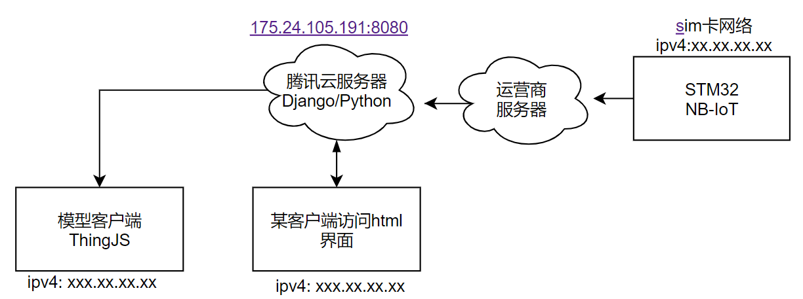
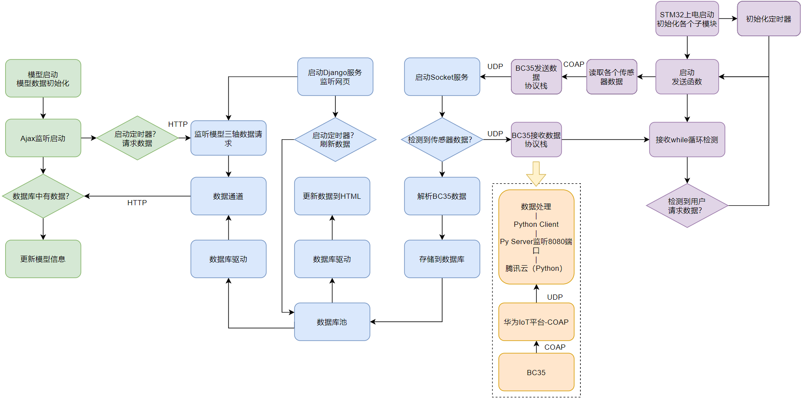
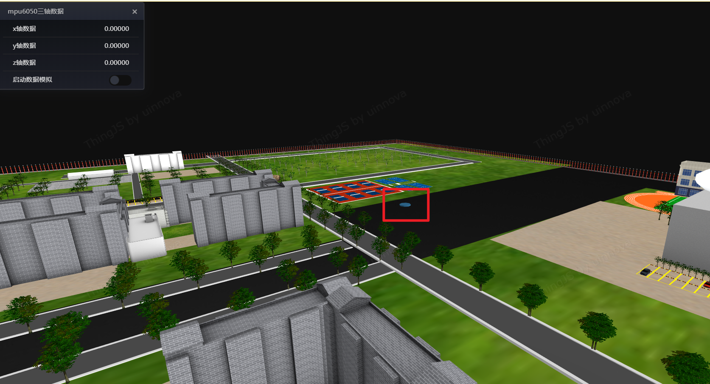

## 技术架构

### 总览



如图所示，为本项目技术组织图。



如图所示为程序流程图

### 下位机


如图所示，下位机流程图

下位机是以STM32为核心的传感器信息采集装置，主要实现对MPU6050三轴数据的采集与传输、振动检测、身份密码校验等功能，利用NB-IoT模块以4G网络为载体进行信息交互传递。NB-IoT为移动运营商提供的硬件平台并配套相应地运营商服务器，NB-IoT模块非传统的4G网络模块的点对点通信模式，而是会将数据直接发送到运营商服务器上，由运营商服务器负责将数据转发到本项目的服务器上。

### 服务器


本项目中的服务器为腾讯云服务器，在服务器上架设两种服务，一种是基于Django的网页监听服务，某客户端通过html网页监听http请求，处理某客户端的请求数据的请求并显示数据到html页面上，**模型的数据请求也包含在该服务内**；一种是基于网络通信的数据监听服务，即监听运营商服务器转发过来的数据信息，并将数据信息存储数据库中。在任何接入ipv4的客户端都可以访问本服务器的内容。

l **HTML前端显示：**Django框架生成的web界面，用于显示三轴数据，报警状态；用于用户点击请求数据功能。

l **Django Python：**Django的python后台程序，用于控制前端显示的数据，监听用户点击按钮请求数据。

l **Python Socket Server：** 服务器数据监听进程。用于监听nb-iot模块发送来的数据，并将数据解析。解析后的数据通过进程管道通信机制传输给Django并将数据存储数据库中；用于保存json文件。

l **管道PIPE通信：** Django无法创建socket通信，因此设定单独的socket server，将socket server和Django分开。**我们将两个模块分别简称为Django进程和socket进程**。两个进程之间通信可以依靠PIPE进程通信解决。Django进程可以接收Socket进程的数据，Socket进程可以处理Django的数据请求。

l **SQL数据库：**用于存储信息为数据库。Socket进程对数据库仅有写的权限，Django进程对数据库仅有读的权限。

l **Json解析器：**生成和保存json文件。

### 模型

模型客户端是依托ThingJS物联网开发平台的虚拟模型可视化装置。前端模型由CampusBuilder塑造还原的校园模型，后端是基于Javascript实现的物体形体控制。通过ThingJS提供的平台可将CampusBuilder生成的模型UI与后端Javascript有机的结合起来。物体形体的控制数据通过Ajax向运行Django的服务器进行http请求，运行Django的服务器会读取数据库信息并返回数据，Javascript会根据数据控制物体的形态，以完成数据闭合流通的过程。


## 服务器配置

### 下载MqSQL

https://dev.mysql.com/get/Downloads/MySQL-8.0/mysql-8.0.19-winx64.zip

### 配置MySQL

解压到C盘，设定配置环境变量路径。

`mysqld --install`

```
mysqld ``--initialize --console
```

`net start mysql`


alter user 'root'@'localhost' identified by 'root';

密码通过在根目录搜索err文件查找


查找


`mysql -u root -p`

密码为上述红线字符串。

成功进入mysql，设定mysql用户名： root，密码为：root

### 开发过程

* python3上安装mysql驱动：

  `python -m pip install PyMySQL -i http://pypi.douban.com/simple --trusted-host=pypi.douban.com`

* 安装安全控件：

  `python -m pip install CoAPthon -i http://pypi.douban.com/simple --trusted-host=pypi.douban.com`

* 数据库开发过程：

  **创建数据：`CREATE DATABASE S02DB;`**

  删除数据库：`drop database S02DB;`

  选择数据库：`use S02DB;`

  **创建数据表：(按照下表创建)**

  | 设备id(id) | 时间(time) | x轴信息(x) | y轴信息(y) | z轴信息(z) | 振动状态（vt） | 位置信息（gps） | 管理员状态(at) |
  | ---------- | ---------- | ---------- | ---------- | ---------- | -------------- | --------------- | -------------- |
  | var        | var        | var        | var        | var        | bool           | var             | bool           |

  ```mysql
  CREATE TABLE IF NOT EXISTS `s02table`(
     `number` INT UNSIGNED NOT NULL auto_increment, 
     `id` INT UNSIGNED,
     `time` VARCHAR(100) NOT NULL,
     `x` VARCHAR(40) NOT NULL,
     `y` VARCHAR(40) NOT NULL,
     `z` VARCHAR(40) NOT NULL,
     `vt` BOOL NOT NULL,
     `gps` VARCHAR(80) NOT NULL,
     `at` BOOL NOT NULL,
     PRIMARY KEY ( `number` )
  )ENGINE=InnoDB DEFAULT CHARSET=utf8;
  ```
```
  

  
删除在数据库中的数据表：`DROP TABLE s02table;`
  
插入数据：
  
  ```mysql
  INSERT INTO s02table ( number, id, time,x,y,z,vt,gps,at )
                         VALUES
                         ( 3, "123456", "2020/02/03/12:45:36","12.2578", "25.3658","125.2256",0,"12.56565,121.4484847",1);
```

读取数据库：`select * from s02table;`


  ```mysql
  alter table s02table add number int first;
  ```

  ```
  UPDATE s02table SET number='0' WHERE runoob_id="123456";
  ```

ALTER TABLE `s02table` DROP PRIMARY KEY ,ADD PRIMARY KEY ( `number` );

alter table s02table modify number int auto_increment;

truncate table s02table;

## COAP开发

安装coapython：

`python -m pip install CoAPthon -i http://pypi.douban.com/simple --trusted-host=pypi.douban.com`

安装MongoDB依赖：

下载：https://fastdl.mongodb.org/windows/mongodb-windows-x86_64-4.3.4.zip

解压，配置环境变量。在c盘创建data文件夹，再在data文件夹创建db文件夹，同时在data文件夹中创建log文件夹。

在mongodb的根目录创建mongod.cfg文件，文件内部写入：

  ```
  systemLog:
      destination: file
      path: c:\data\log\mongod.log
  storage:
      dbPath: c:\data\db
  ```

在终端运行安装mongo：

 ` mongod --config "c:\opt\mongodb-windows-x86_64-4.3.4\mongod.cfg" --install`

启动mongoDB服务：

`net start MongoDB`

在终端运行mango：

`mongo`

进入mongo后，对mongo数据库进行coap支持配置：

`use resourceDirectory`

`db.createUser( {user: "RD",pwd: "res-dir",roles: [ { role: "readWrite", db: "resourceDirectory" } ] } )`

`db.resources.createIndex( { "ep": 1, "d": 1 }, { unique: true } )`

### 请求方法

  - 0.01 GET：获取资源

  - 0.02 POST：创建资源

  - 0.03 PUT：更新资源

- 0.04 DELETE：删除资源
  
### 安装OpenSSL

  下载： http://slproweb.com/download/Win64OpenSSL_Light-1_1_1e.msi

  配置环境路径

  需要vc2015 res x64

1. 打开windows命令行窗口，输入where openssl，查询是否安装openssl。

`where openssl `


​     

2. 创建测试CA证书。
1. 创建私钥。

`openssl genrsa -out ca-key.pem 1024 `

2. 创建证书请求。

`openssl req -new -out ca-req.csr -key ca-key.pem `

3. 自签署证书。

`openssl x509 -req -in ca-req.csr -out ca-cert.pem -signkey ca-key.pem -days 3650 `

3. 生成server证书。

1. 创建私钥。

`openssl genrsa -out server.key 1024 `

2. 创建证书请求。
`openssl req -new -out server-req.csr -key server.key `
  
3. 自签署证书。
`openssl x509 -req -in server-req.csr -out server.cert -signkey server.key -CA ca-cert.pem -CAkey ca-key.pem -CAcreateserial -days 3650 `


4. 生成client证书。


1. 创建私钥。
`openssl genrsa -out client.key 1024 `
2. 创建证书请求。
`openssl req -new -out client-req.csr -key client.key `
3. 自签署证书。
`openssl x509 -req -in client-req.csr -out client.cert -signkey client.key -CA ca-cert.pem -CAkey ca-key.pem -CAcreateserial -days 3650 `

5. 在Demo工程中，已经配置好生成的server证书。
python -m pip install flask -i http://pypi.douban.com/simple --trusted-host=pypi.douban.com

python -m pip install requests -i http://pypi.douban.com/simple --trusted-host=pypi.douban.com

## 使用方法关键记录

请参考教学视频，以下为关键步骤的记录。

step1： 在服务器端启动django服务:  新建一个cmd终端

`cd /d c:\workspace\s02-django-jg-prj\django-test\HelloWorld`

`python manage.py runserver 0.0.0.0:8080 `


step2:   服务器端系统启动socket服务：再新建一个cmd终端

`cd c:\workspace\s02-django-jg-prj\s02-socket-server`

`python main`


### 页端使用

step3:   在本地浏览器（任意一台联网的电脑或者手机都可以）输入： http://175.24.105.191:8080/index

OK，就可以看到更新数据了。

### 模型使用

step4: 在本地浏览器输入：http://www.thingjs.com/guide/?m=sample

（注意上述网址必须是http开头而非https开头，否则由于浏览器CPS策略影响，不能交互数据。）

井盖位置



step5: 打开开关；


## 参考文献：

1. 打开lesql.html
2. https://www.runoob.com/mysql/mysql-where-clause.html

